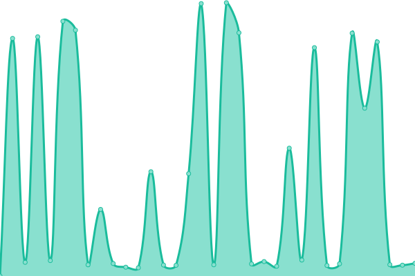

# [📈 Live Status](https://mtitservice.github.io/site): <!--live status--> **🟧 Partial outage**

This repository contains the open-source uptime monitor and status page for [mtitservice](https://mtitservice.github.io/site), powered by [Upptime](https://github.com/upptime/upptime).

With [Upptime](https://upptime.js.org), you can get your own unlimited and free uptime monitor and status page, powered entirely by a GitHub repository. We use [Issues](https://github.com/mtitservice/site/issues) as incident reports, [Actions](https://github.com/mtitservice/site/actions) as uptime monitors, and [Pages](https://mtitservice.github.io/site) for the status page.

<!--start: status pages-->
<!-- This summary is generated by Upptime (https://github.com/upptime/upptime) -->
<!-- Do not edit this manually, your changes will be overwritten -->
<!-- prettier-ignore -->
| URL | Status | History | Response Time | Uptime |
| --- | ------ | ------- | ------------- | ------ |
|  [https://salfeet.plo.ps](https://salfeet.plo.ps) | 🟩 Up | [https-salfeet-plo-ps.yml](https://github.com/mtitservice/site/commits/HEAD/history/https-salfeet-plo-ps.yml) | 

 5517ms
     
 | 

<a href="https://mtitservice.github.io/site/history/https-salfeet-plo-ps">66.48%</a>
    

|  [https://takaful.salfeet.plo.ps](https://takaful.salfeet.plo.ps) | 🟩 Up | [https-takaful-salfeet-plo-ps.yml](https://github.com/mtitservice/site/commits/HEAD/history/https-takaful-salfeet-plo-ps.yml) | 

 5435ms
     
 | 

<a href="https://mtitservice.github.io/site/history/https-takaful-salfeet-plo-ps">61.90%</a>
    

|  [https://www.perc.ps](https://www.perc.ps) | 🟩 Up | [https-www-perc-ps.yml](https://github.com/mtitservice/site/commits/HEAD/history/https-www-perc-ps.yml) | 

 4750ms
     
 | 

<a href="https://mtitservice.github.io/site/history/https-www-perc-ps">70.25%</a>
    

|  [https://www.pncecs.plo.ps](https://www.pncecs.plo.ps) | 🟩 Up | [https-www-pncecs-plo-ps.yml](https://github.com/mtitservice/site/commits/HEAD/history/https-www-pncecs-plo-ps.yml) | 

 7521ms
     
 | 

<a href="https://mtitservice.github.io/site/history/https-www-pncecs-plo-ps">71.39%</a>
    

|  [https://www.nra.moh.ps](https://www.nra.moh.ps) | 🟥 Down | [https-www-nra-moh-ps.yml](https://github.com/mtitservice/site/commits/HEAD/history/https-www-nra-moh-ps.yml) | 

 0ms
     
 | 

<a href="https://mtitservice.github.io/site/history/https-www-nra-moh-ps">0.00%</a>
    

|  [https://www.af.moh.ps](https://www.af.moh.ps) | 🟥 Down | [https-www-af-moh-ps.yml](https://github.com/mtitservice/site/commits/HEAD/history/https-www-af-moh-ps.yml) | 

 0ms
     
 | 

<a href="https://mtitservice.github.io/site/history/https-www-af-moh-ps">0.00%</a>
    

|  [https://www.numbering.mtit.pna.ps](https://www.numbering.mtit.pna.ps) | 🟥 Down | [https-www-numbering-mtit-pna-ps.yml](https://github.com/mtitservice/site/commits/HEAD/history/https-www-numbering-mtit-pna-ps.yml) | 

 0ms
     
 | 

<a href="https://mtitservice.github.io/site/history/https-www-numbering-mtit-pna-ps">0.00%</a>
    

|  [https://www.hebron.plo.ps](https://www.hebron.plo.ps) | 🟥 Down | [https-www-hebron-plo-ps.yml](https://github.com/mtitservice/site/commits/HEAD/history/https-www-hebron-plo-ps.yml) | 

 0ms
     
 | 

<a href="https://mtitservice.github.io/site/history/https-www-hebron-plo-ps">0.00%</a>
    

|  [https://www.nlp.ps](https://www.nlp.ps) | 🟥 Down | [https-www-nlp-ps.yml](https://github.com/mtitservice/site/commits/HEAD/history/https-www-nlp-ps.yml) | 

 0ms
     
 | 

<a href="https://mtitservice.github.io/site/history/https-www-nlp-ps">0.00%</a>
    

|  [https://www.ndrmc.gov.ps](https://www.ndrmc.gov.ps) | 🟥 Down | [https-www-ndrmc-gov-ps.yml](https://github.com/mtitservice/site/commits/HEAD/history/https-www-ndrmc-gov-ps.yml) | 

 0ms
     
 | 

<a href="https://mtitservice.github.io/site/history/https-www-ndrmc-gov-ps">0.00%</a>
    

|  [https://bethlehem.gov.ps](https://bethlehem.gov.ps) | 🟥 Down | [https-bethlehem-gov-ps.yml](https://github.com/mtitservice/site/commits/HEAD/history/https-bethlehem-gov-ps.yml) | 

 0ms
     
 | 

<a href="https://mtitservice.github.io/site/history/https-bethlehem-gov-ps">0.00%</a>
    

|  [https://diaspora.ps](https://diaspora.ps) | 🟥 Down | [https-diaspora-ps.yml](https://github.com/mtitservice/site/commits/HEAD/history/https-diaspora-ps.yml) | 

 0ms
     
 | 

<a href="https://mtitservice.github.io/site/history/https-diaspora-ps">0.00%</a>
    

|  [https://mfa.pna.ps](https://mfa.pna.ps) | 🟥 Down | [https-mfa-pna-ps.yml](https://github.com/mtitservice/site/commits/HEAD/history/https-mfa-pna-ps.yml) | 

 0ms
     
 | 

<a href="https://mtitservice.github.io/site/history/https-mfa-pna-ps">0.00%</a>
    

|  [https://palpro.ps](https://palpro.ps) | 🟩 Up | [https-palpro-ps.yml](https://github.com/mtitservice/site/commits/HEAD/history/https-palpro-ps.yml) | 

 4882ms
     
 | 

<a href="https://mtitservice.github.io/site/history/https-palpro-ps">89.51%</a>
    

|  [https://scout.ps](https://scout.ps) | 🟥 Down | [https-scout-ps.yml](https://github.com/mtitservice/site/commits/HEAD/history/https-scout-ps.yml) | 

 0ms
     
 | 

<a href="https://mtitservice.github.io/site/history/https-scout-ps">0.00%</a>
    

|  [https://palcp.ps](https://palcp.ps) | 🟩 Up | [https-palcp-ps.yml](https://github.com/mtitservice/site/commits/HEAD/history/https-palcp-ps.yml) | 

 5041ms
     
 | 

<a href="https://mtitservice.github.io/site/history/https-palcp-ps">77.18%</a>
    

|  [https://harmonization.moj.pna.ps](https://harmonization.moj.pna.ps) | 🟩 Up | [https-harmonization-moj-pna-ps.yml](https://github.com/mtitservice/site/commits/HEAD/history/https-harmonization-moj-pna-ps.yml) | 

 6927ms
     
 | 

<a href="https://mtitservice.github.io/site/history/https-harmonization-moj-pna-ps">89.78%</a>
    

|  [https://verify.moj.pna.ps](https://verify.moj.pna.ps) | 🟩 Up | [https-verify-moj-pna-ps.yml](https://github.com/mtitservice/site/commits/HEAD/history/https-verify-moj-pna-ps.yml) | 

 4532ms
     
 | 

<a href="https://mtitservice.github.io/site/history/https-verify-moj-pna-ps">84.06%</a>
    

|  [https://moj.pna.ps](https://moj.pna.ps) | 🟩 Up | [https-moj-pna-ps.yml](https://github.com/mtitservice/site/commits/HEAD/history/https-moj-pna-ps.yml) | 

 3326ms
     
 | 

<a href="https://mtitservice.github.io/site/history/https-moj-pna-ps">68.21%</a>
    

|  [https://ejrs.moj.pna.ps](https://ejrs.moj.pna.ps) | 🟩 Up | [https-ejrs-moj-pna-ps.yml](https://github.com/mtitservice/site/commits/HEAD/history/https-ejrs-moj-pna-ps.yml) | 

 3200ms
     
 | 

<a href="https://mtitservice.github.io/site/history/https-ejrs-moj-pna-ps">94.09%</a>
    

|  [https://moj.pna.ps](https://moj.pna.ps) | 🟩 Up | [https-moj-pna-ps.yml](https://github.com/mtitservice/site/commits/HEAD/history/https-moj-pna-ps.yml) | 

 3326ms
     
 | 

<a href="https://mtitservice.github.io/site/history/https-moj-pna-ps">68.21%</a>
    

|  [https://gcc2.mtit.pna.ps](https://gcc2.mtit.pna.ps) | 🟩 Up | [https-gcc2-mtit-pna-ps.yml](https://github.com/mtitservice/site/commits/HEAD/history/https-gcc2-mtit-pna-ps.yml) | 

 2803ms
     
 | 

<a href="https://mtitservice.github.io/site/history/https-gcc2-mtit-pna-ps">85.70%</a>
    

|  [https://ppsmo.ps](https://ppsmo.ps) | 🟩 Up | [https-ppsmo-ps.yml](https://github.com/mtitservice/site/commits/HEAD/history/https-ppsmo-ps.yml) | 

 4245ms
     
 | 

<a href="https://mtitservice.github.io/site/history/https-ppsmo-ps">71.90%</a>
    

|  [https://palpost.ps](https://palpost.ps) | 🟩 Up | [https-palpost-ps.yml](https://github.com/mtitservice/site/commits/HEAD/history/https-palpost-ps.yml) | 

 5541ms
     
 | 

<a href="https://mtitservice.github.io/site/history/https-palpost-ps">79.28%</a>
    

|  [https://archive.minfo.ps](https://archive.minfo.ps) | 🟥 Down | [https-archive-minfo-ps.yml](https://github.com/mtitservice/site/commits/HEAD/history/https-archive-minfo-ps.yml) | 

 8191ms
     
 | 

<a href="https://mtitservice.github.io/site/history/https-archive-minfo-ps">61.88%</a>
    

|  [https://treport.mtit.pna.ps](https://treport.mtit.pna.ps) | 🟩 Up | [https-treport-mtit-pna-ps.yml](https://github.com/mtitservice/site/commits/HEAD/history/https-treport-mtit-pna-ps.yml) | 

 2767ms
     
 | 

<a href="https://mtitservice.github.io/site/history/https-treport-mtit-pna-ps">65.22%</a>
    

|  [https://hcie.ps](https://hcie.ps) | 🟩 Up | [https-hcie-ps.yml](https://github.com/mtitservice/site/commits/HEAD/history/https-hcie-ps.yml) | 

 21328ms
     
 | 

<a href="https://mtitservice.github.io/site/history/https-hcie-ps">78.83%</a>
    

|  [https://ftp.mtit.pna.ps](https://ftp.mtit.pna.ps) | 🟥 Down | [https-ftp-mtit-pna-ps.yml](https://github.com/mtitservice/site/commits/HEAD/history/https-ftp-mtit-pna-ps.yml) | 

 0ms
     
 | 

<a href="https://mtitservice.github.io/site/history/https-ftp-mtit-pna-ps">0.00%</a>
    

|  [https://sfjc.sec.ps](https://sfjc.sec.ps) | 🟥 Down | [https-sfjc-sec-ps.yml](https://github.com/mtitservice/site/commits/HEAD/history/https-sfjc-sec-ps.yml) | 

 997ms
     
 | 

<a href="https://mtitservice.github.io/site/history/https-sfjc-sec-ps">0.00%</a>
    

|  [https://mtit.pna.ps](https://mtit.pna.ps) | 🟩 Up | [https-mtit-pna-ps.yml](https://github.com/mtitservice/site/commits/HEAD/history/https-mtit-pna-ps.yml) | 

 3883ms
     
 | 

<a href="https://mtitservice.github.io/site/history/https-mtit-pna-ps">73.24%</a>
    

|  [https://minfo.ps](https://minfo.ps) | 🟩 Up | [https-minfo-ps.yml](https://github.com/mtitservice/site/commits/HEAD/history/https-minfo-ps.yml) | 

 4835ms
     
 | 

<a href="https://mtitservice.github.io/site/history/https-minfo-ps">62.90%</a>
    

|  [https://detulkarm.edu.ps](https://detulkarm.edu.ps) | 🟥 Down | [https-detulkarm-edu-ps.yml](https://github.com/mtitservice/site/commits/HEAD/history/https-detulkarm-edu-ps.yml) | 

 2556ms
     
 | 

<a href="https://mtitservice.github.io/site/history/https-detulkarm-edu-ps">52.66%</a>
    

|  [https://mob.pji.pna.ps](https://mob.pji.pna.ps) | 🟥 Down | [https-mob-pji-pna-ps.yml](https://github.com/mtitservice/site/commits/HEAD/history/https-mob-pji-pna-ps.yml) | 

 1274ms
     
 | 

<a href="https://mtitservice.github.io/site/history/https-mob-pji-pna-ps">0.00%</a>
    

|  [https://db.hcys.ps](https://db.hcys.ps) | 🟩 Up | [https-db-hcys-ps.yml](https://github.com/mtitservice/site/commits/HEAD/history/https-db-hcys-ps.yml) | 

 2018ms
     
 | 

<a href="https://mtitservice.github.io/site/history/https-db-hcys-ps">73.63%</a>
    

|  [https://reports.mtit.pna.ps](https://reports.mtit.pna.ps) | 🟩 Up | [https-reports-mtit-pna-ps.yml](https://github.com/mtitservice/site/commits/HEAD/history/https-reports-mtit-pna-ps.yml) | 

 4565ms
     
 | 

<a href="https://mtitservice.github.io/site/history/https-reports-mtit-pna-ps">75.64%</a>
    

|  [https://911.ps](https://911.ps) | 🟩 Up | [https-911-ps.yml](https://github.com/mtitservice/site/commits/HEAD/history/https-911-ps.yml) | 

 2111ms
     
 | 

<a href="https://mtitservice.github.io/site/history/https-911-ps">73.31%</a>
    

<!--end: status pages-->

[**Visit our status website →**](https://mtitservice.github.io/site)

## 📄 License

- Powered by: [Upptime](https://github.com/upptime/upptime)
- Code: [MIT](./LICENSE) © [mtitservice](https://mtitservice.github.io/site)
- Data in the `./history` directory: [Open Database License](https://opendatacommons.org/licenses/odbl/1-0/)
